# ⭐ Zdalnie Sterowany Robot (C, STM32)

Zdalnie sterowany robot oparty na mikrokontrolerze **STM32G071RB** z czujnikiem **HC-SR04** oraz komunikacją **Bluetooth**.

> ⚠️ **Uwaga:** Nie podłączaj baterii do mikrokontrolera bez zmiany ustawień zworki!  
> Domyślnie zworka jest ustawiona w pozycji ST-LINK, co oznacza, że mikrokontroler jest zasilany przez port Micro USB. Baterie podłącz na końcu, gdy cały projekt będzie gotowy. Następnie przełóż zworkę na pozycję VIN, co pozwoli zasilić mikrokontroler napięciem do 12 V. W przeciwnym razie możesz uszkodzić płytkę!  
> ⚠️

  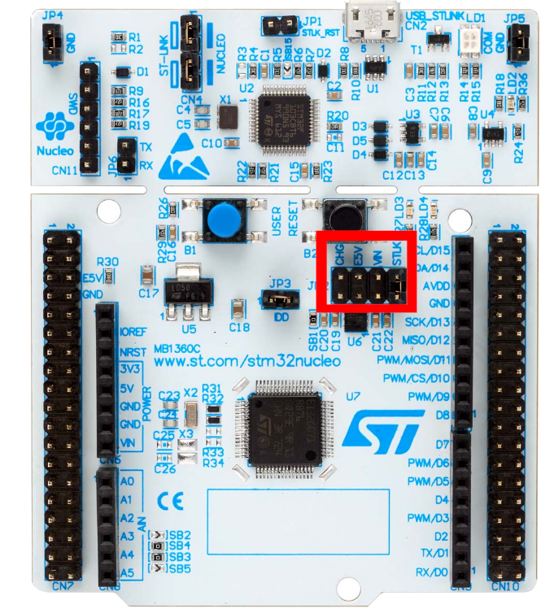

## 📦 1. Podzespoły

- 🛞 **Podwozie własnego projektu** – góra i dół wycięte na laserze, połączone śrubami 10mm, a ścianki wydrukowane w 3D (Archiwum CircularChassis2WD)
https://github.com/szymon-tulodziecki/CircularChassis2WD

- 📦 **Nucleo-G071RB** – zestaw startowy z mikrokontrolerem STM32G071RB
- 📶 **Bluetooth HC-05** – moduł komunikacji bezprzewodowej
- ⚙️ **L293D** – 2-kanałowy sterownik silników
- 📏 **HC-SR04** – ultradźwiękowy czujnik odległości
- 🔋 **Ogniwa 18650 (x3)** – akumulatory zasilające
- 🧰 **Koszyk na ogniwa 18650 (szeregowy)** – uchwyt na baterie
- 🔌 **Przewody M-F 17 cm** – przewody połączeniowe
- 🔩 **Zestaw śrub i tulei M3** – do montażu mechanicznego
- 🧪 **Płytka stykowa (170 pól)** – do prototypowania połączeń

---

## 🔌 2. Schemat Połączeń

  

  

---

## 🛠️ 3. Konfiguracja projektu STM32CubeIDE

> W tej sekcji przedstawiona jest pełna konfiguracja środowiska **STM32CubeIDE**, w tym tworzenie projektu, ustawienia pinów, timerów oraz komunikacji przez USART.

---

### ⚙️ 3.1 Tworzenie projektu

#### Wybierz mikrokontroler STM32G071RB i opcję "NUCLEO"

  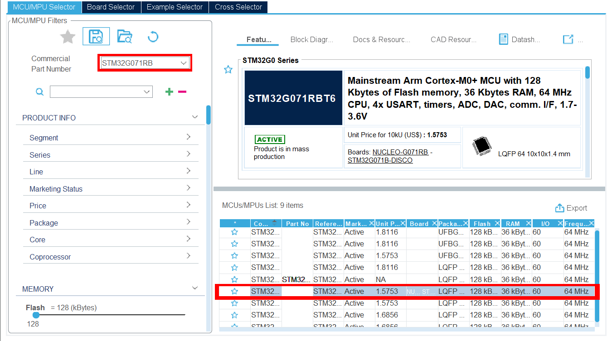

#### Nazwij swój projekt i utwórz go

  

---

### 📌 3.2 Konfiguracja pinów oraz ustawień projektu:

  

#### Skonfiguruj piny PA0, PA1, PA4, PA5 jako `GPIO_Output`, zgodnie ze schematem, i nadaj im odpowiednie nazwy (IN1, IN2, IN3, IN4): 

  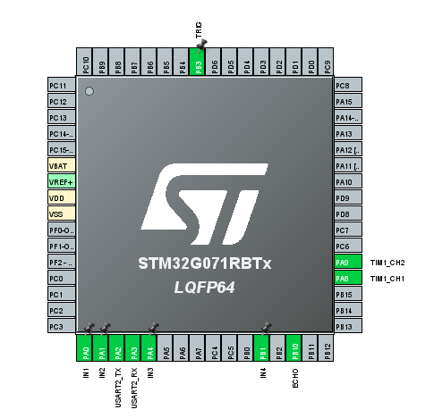

#### Wyszukaj "USART2" i włącz go w trybie asynchronicznym, ustawiając Baud Rate na 9600:

  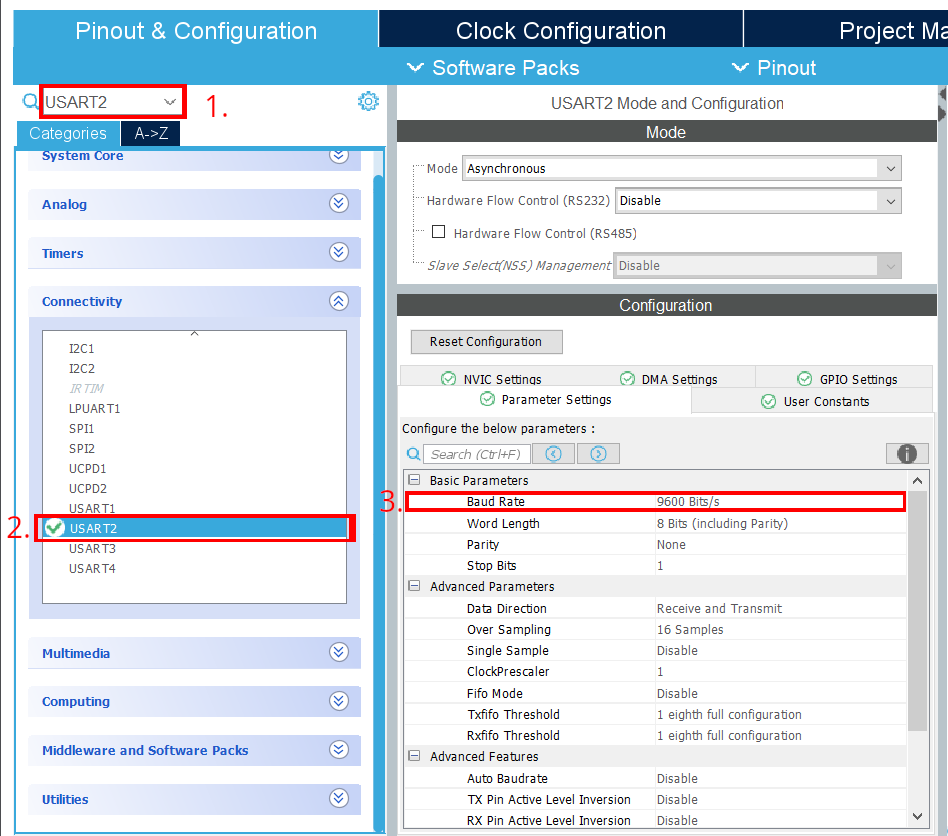

#### Przejdź do zakładki "NVIC Setting" i włącz przerwania:

  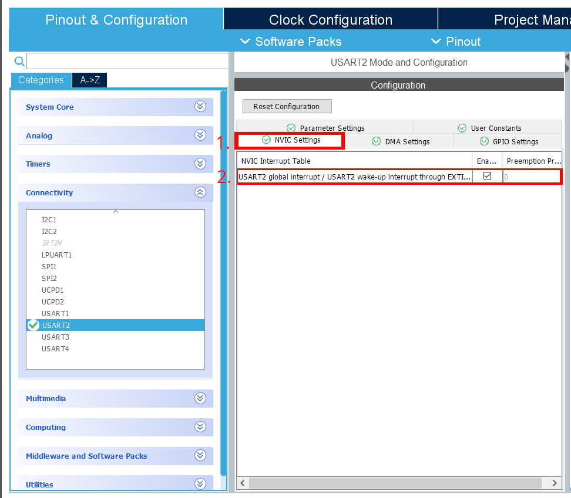

> Włączenie USART2 automatycznie skonfiguruje odpowiednie porty i nada im nazwy

#### W sekcji Timers dla timera 1 ustaw PWM Generation CH1 dla Channel 1 oraz PWM Generation CH2 dla Channel 2:

  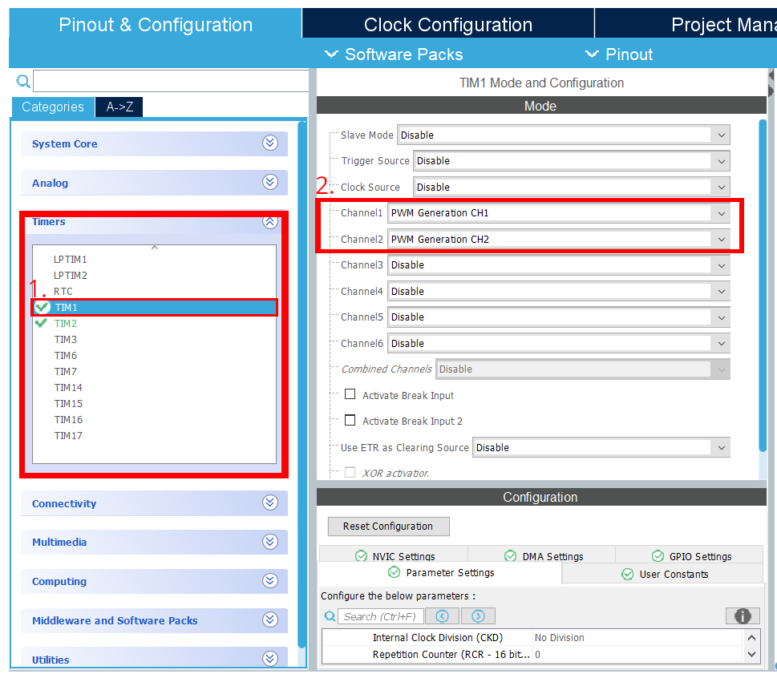

#### Ustaw wartość Prescaler na 16, a Counter Period na 999:

  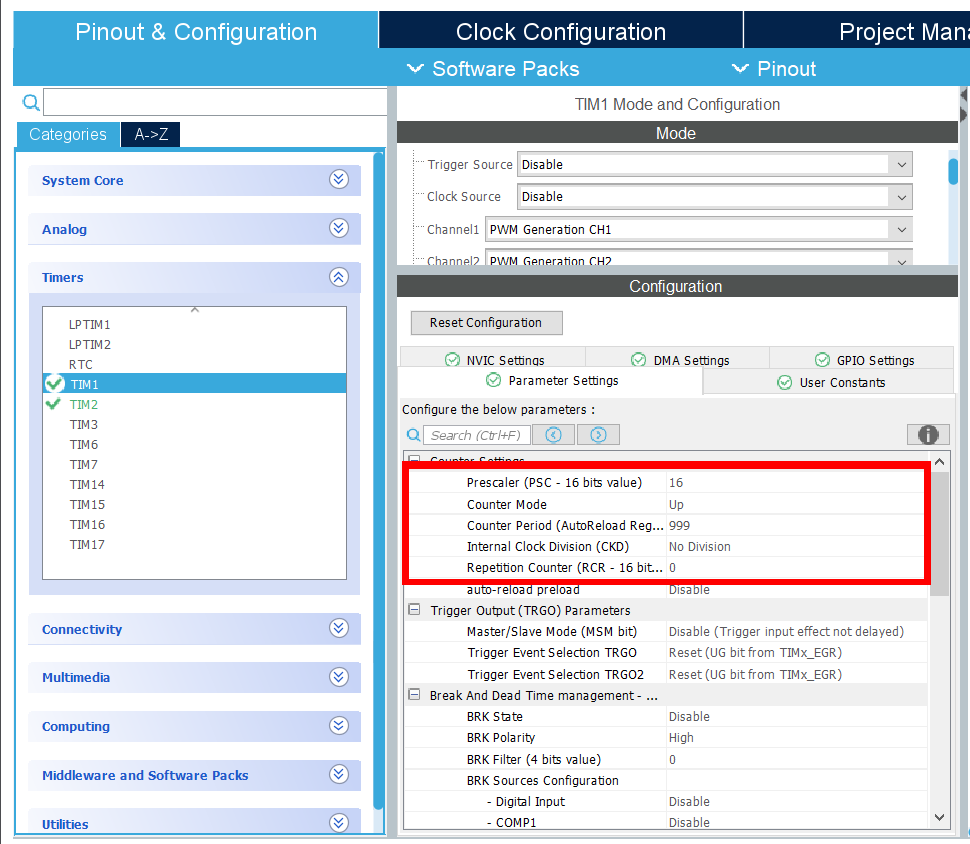

> Włączenie kanałów na Timerze automatycznie skonfiguruje odpowiednie porty i nada im nazwy

#### Przejdź do timera 2 i ustaw Channel 2 w trybie Input Capture Direct Mode:

  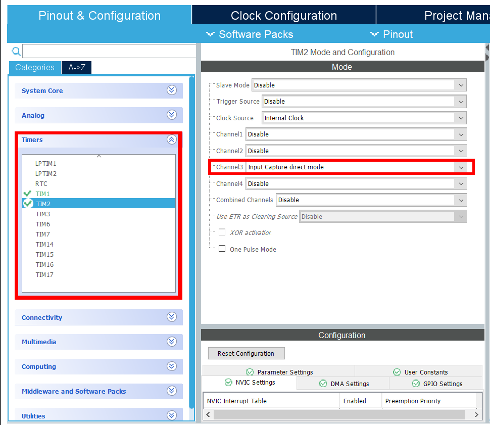

#### Ustaw Prescaler na 16:

  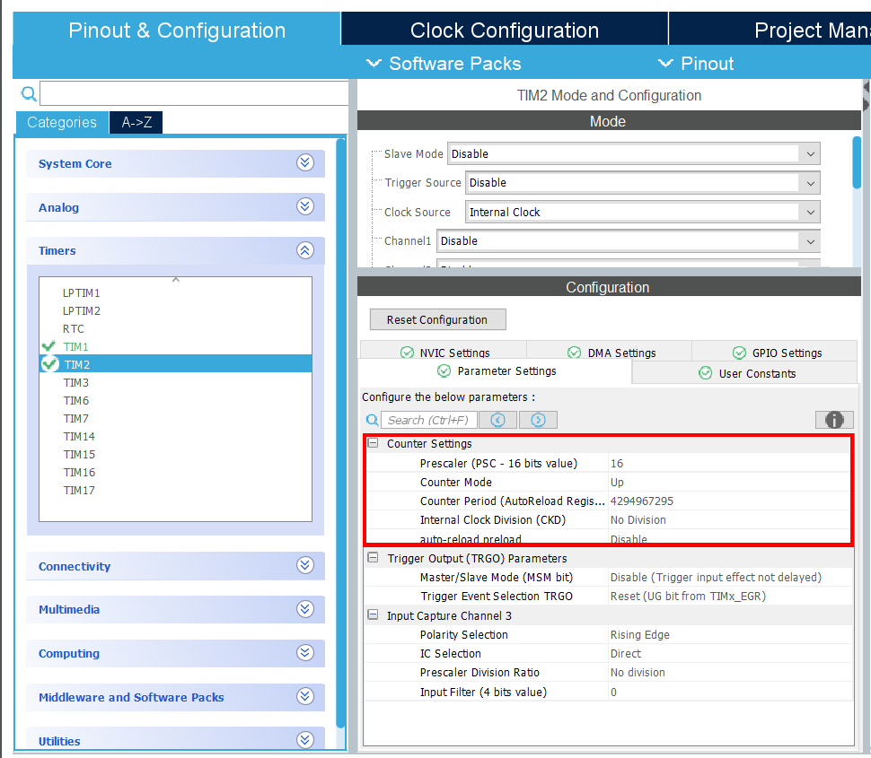

> Analogicznie dla timera 2 ustawienie jego kanału nada mu nazwę ale tym razem dla wygody zmienimy ją (kolejny krok)

#### Pin PB3 ustaw w trybie `GPIO_Output` i nadaj mu nazwę `TRIG`, a pinu PB10 (Channel 2 timera 2) nazwę `ECHO`:

  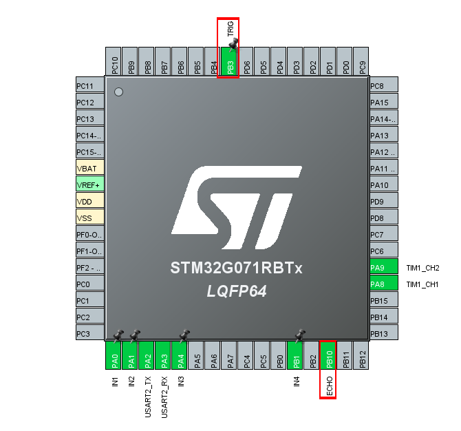

#### Włącz przerwania dla Timera 2:

  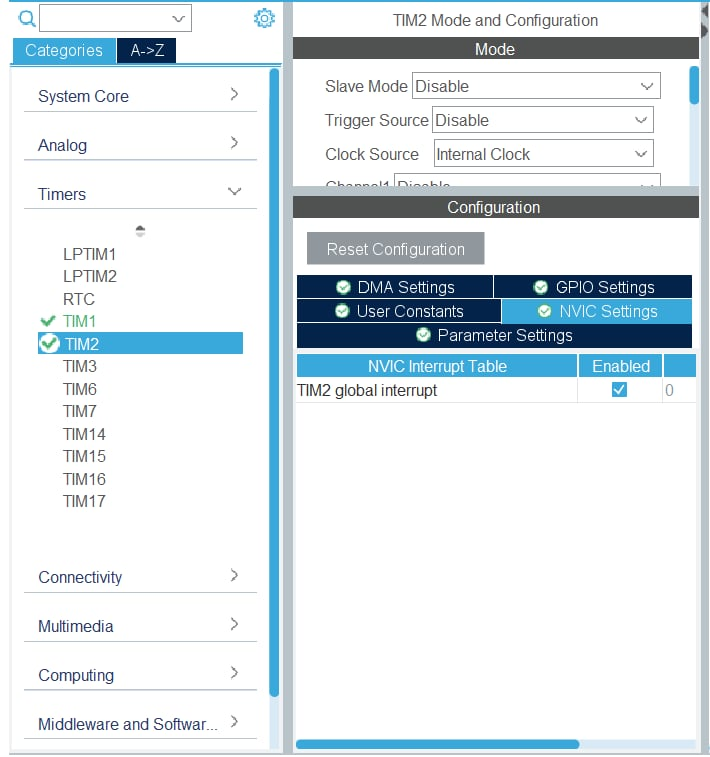

---
### 📁 4. Zapisz projekt i wygeneruj kod

1. **Zapisz projekt** w STM32CubeIDE, akceptując generowanie kodu.
2. **Wklej kod z załącznika** do funkcji `main`.
3. **Podłącz płytkę Nucleo** do komputera, skompiluj projekt i wgraj go na mikrokontroler.
4. **Odłącz kabel USB**, przełóż zworkę na pozycję VIN i podłącz baterię zgodnie ze schematem.

#### 🧑‍💻 Kluczowe funkcje kodu (C, HAL):

- Sterowanie mostkiem H (jazda do przodu/do tyłu, skręcanie, zatrzymanie)
- Obsługa czujnika HC-SR04 (generowanie sygnału trigger, pomiar czasu echa, obliczanie odległości)
- Odbiór komend przez UART (Bluetooth), wywoływanie funkcji ruchu oraz zmiana prędkości przez PWM

---

### 📱 5. Aplikacja sterująca

> Do sterowania robotem służy dedykowana aplikacja, komunikująca się z modułem Bluetooth HC-05, działająca na systemach Windows.

Aplikację możesz pobrać z repozytorium GitHub:  
[https://github.com/szymon-tulodziecki/rcar-control-app](https://github.com/szymon-tulodziecki/rcar-control-app)

  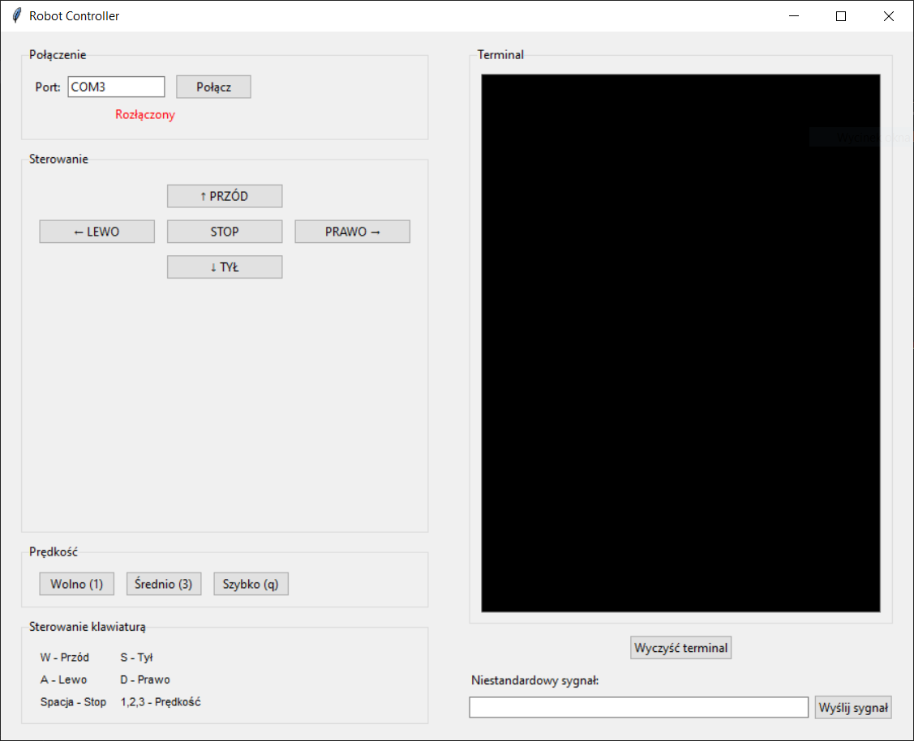

---

## 📝 Podsumowanie

Projekt przedstawia kompletny system zdalnie sterowanego robota opartego na STM32, wyposażonego w czujnik odległości oraz komunikację Bluetooth. W dokumentacji znajdziesz szczegółowe instrukcje dotyczące montażu, konfiguracji sprzętu i oprogramowania, a także gotową aplikację do sterowania robotem.  
Całość stanowi świetny punkt wyjścia do nauki programowania mikrokontrolerów, obsługi peryferiów oraz budowy własnych projektów robotycznych.

Zachęcam do rozwijania projektu i dzielenia się swoimi pomysłami!