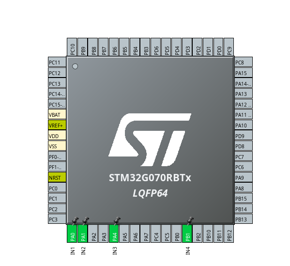

# ⭐ Zdalnie Sterowany Robot (C, STM32)

Zdalnie sterowany robot oparty na mikrokontrolerze **STM32G070RB** z czujnikiem **HC-SR04** oraz komunikacją **Bluetooth**.

> ⚠️ **Uwaga:** Nie podłączaj baterii do mikrokontrolera bez zmiany ustawień zworki!  
> Domyślnie zworka jest ustawiona w pozycji ST-LINK, co oznacza, że mikrokontroler jest zasilany przez port Micro USB. Baterie podłącz na końcu, gdy cały projekt będzie gotowy. Następnie przełóż zworkę na pozycję VIN, co pozwoli zasilić mikrokontroler napięciem do 12 V. W przeciwnym razie możesz uszkodzić płytkę!  
> ⚠️

  

## 📦 1. Podzespoły

- 🛞 **Chassis Rectangle 2WD** – 2-kołowe podwozie robota z napędem
- 📦 **Nucleo-G070RB** – zestaw startowy z mikrokontrolerem STM32G070RB
- 📶 **Bluetooth HC-05** – moduł komunikacji bezprzewodowej
- ⚙️ **L293D** – 2-kanałowy sterownik silników
- 📏 **HC-SR04** – ultradźwiękowy czujnik odległości
- 🔋 **Ogniwa 18650 (x3)** – akumulatory zasilające
- 🧰 **Koszyk na ogniwa 18650 (szeregowy)** – uchwyt na baterie
- 🔌 **Przewody M-F 17 cm** – przewody połączeniowe
- 🔩 **Zestaw śrub i tulei M3** – do montażu mechanicznego
- 🧪 **Płytka stykowa (170 pól)** – do prototypowania połączeń

---

## 🔌 2. Schemat Połączeń

  

  

---

## 🛠️ 3. Konfiguracja projektu STM32CubeIDE

> W tej sekcji przedstawiona jest pełna konfiguracja środowiska **STM32CubeIDE**, w tym tworzenie projektu, ustawienia pinów, timerów oraz komunikacji przez USART.

---

### ⚙️ 3.1 Tworzenie projektu

#### Wybierz mikrokontroler STM32G070RB i opcję "NUCLEO"

  

#### Nazwij swój projekt i utwórz go

  

---

### 📌 3.2 Schemat i konfiguracja pinów

  

#### Skonfiguruj GPIO jako `GPIO_Output`, zgodnie ze schematem, i nadaj im odpowiednie nazwy: 

  

#### Wyszukaj "USART2" i włącz go w trybie asynchronicznym, ustawiając Baud Rate na 9600:

  

#### Przejdź do zakładki "NVIC Setting" i włącz przerwania:

  

#### W sekcji Timers dla timera 1 ustaw PWM Generation CH1 dla Channel 1 oraz PWM Generation CH2 dla Channel 2:

  

#### Ustaw wartość Prescaler na 16, a Counter Period na 999:

  

#### Przejdź do timera 2 i ustaw Channel 3 w trybie Input Capture Direct Mode:

  

#### Ustaw Prescaler na 16:

  

#### Pin PB3 ustaw w trybie `GPIO_Output` i nadaj mu nazwę `TRIG`, a pinu PB10 (Channel 2 timera 2) nazwę `ECHO`:

  

