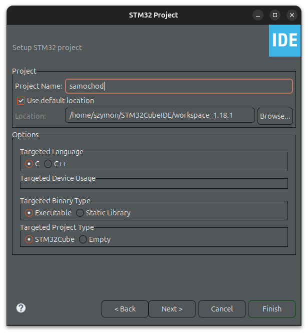
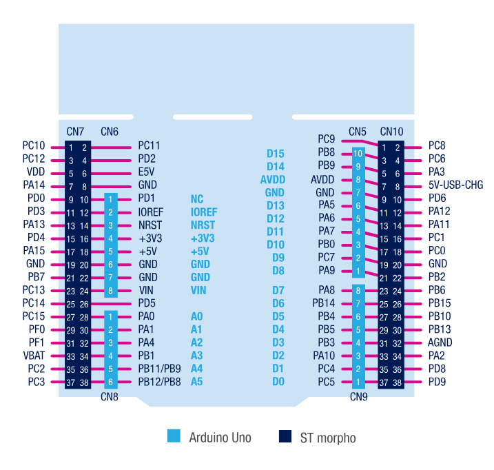

# ⭐ Zdalnie Sterowany Robot (C, STM32)

Zdalnie sterowany robot oparty na mikrokontrolerze STM32G070RB z czujnikiem HC-SR04 oraz komunikacją Bluetooth.

> **⚠️ Uwaga: Kroki wykonania są istotne, patrz punkt 4.**

## 1. Podzespoły

- Chassis Rectangle 2WD - 2-kołowe podwozie robota z napędem.

- Nucleo-G070RB - zestaw startowy z mikrokontrolerem STM32G070RB.

- Moduł Bluetooth HC-05 - Moduł do komunikacji bezprzewodowej.

- Moduł L293D - 2-kanałowy sterownik silnika - Sterownik do obsługi silników robota.

- Ultradźwiękowy czujnik odległości HC-SR04 - Czujnik do pomiaru odległości.

- Ogniwo 18650 - Akumulator do zasilania robota (3 sztuki).

- Koszyk na 3 akumulatory typu 18650 - Koszyk na akumulatory.

- Przewody połączeniowe M-F różnokolorowe 17 cm (40 szt.) - Przewody do połączeń elektrycznych.

- Zestaw nylonowych śrub i tulei M3.

- Płytka stykowa biała 170 pól prototypowa - Płytka do prototypowania połączeń.

## 2. Schemat Połączeń

## 3. Konfiguracja projektu STM32CubeIDE

> W tej części przedstawiona jest cała konfiguracja środowiska STM32CubeIDE, łącznie z tworzeniem projektu, ustawianiem pinów, timerów oraz komunikacji USART. 
-------------------------------------------------
## 3.1 Tworzenie projektu

### Wyszukujemy STM32G070RB oraz wybieramy opcje "NUCLEO"

### Przechodzimy dalej, nadajemy nazwę swojemu projektowi i go tworzymy

### 3.2 Schemat pinów STM32G070RB

### 3.2 Konfiguracja pinów GPIO_OUTPUT 

